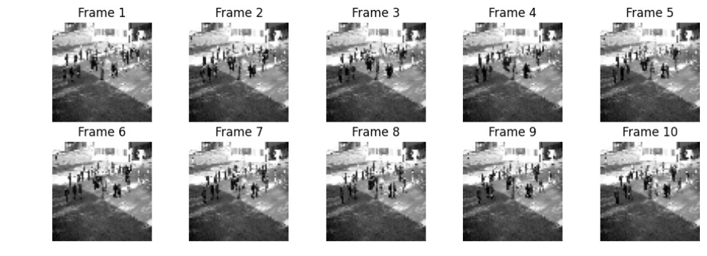
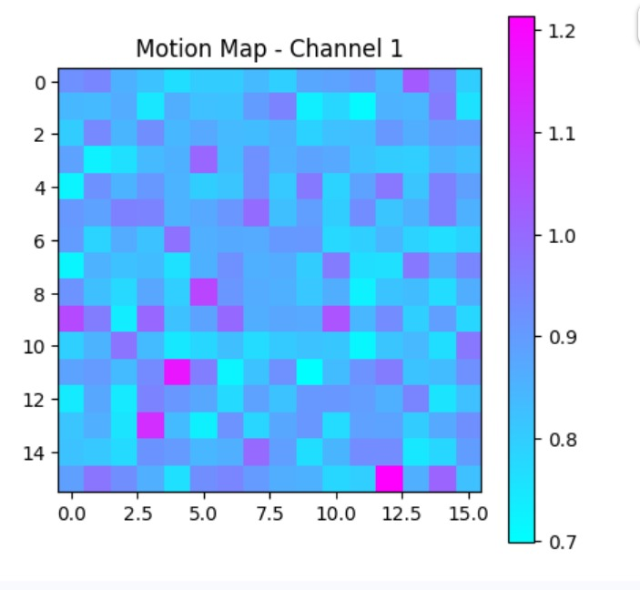
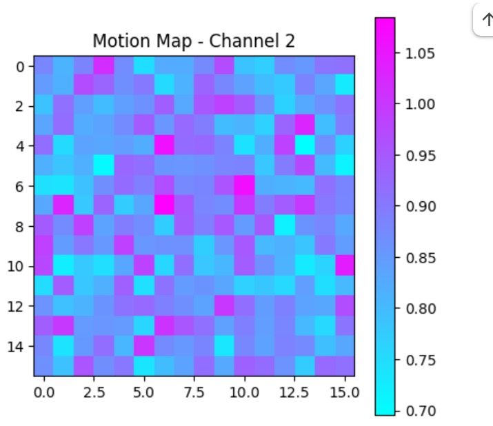

# 📡 Multimodal Spatio-Temporal Crowd Prediction using 3D-CNN + ConvLSTM + Wi-Fi Fusion

A deep learning model that predicts **crowd count**, **density heatmaps**, and **motion patterns** by combining **video frames** and **synthetic Wi-Fi activity signals**.  
This project demonstrates a multimodal architecture capable of understanding both **spatial** and **temporal** crowd dynamics in smart-campus environments.

---

## 🌟 Overview

Traditional crowd analysis models rely only on video data.  
This project enhances prediction accuracy by fusing:

- 🟣 **Visual features** (movement, clusters, density)  
- 🔵 **Wi-Fi activity features** (hotspot usage patterns)

By integrating these complementary signals, the model achieves more robust and context-aware crowd understanding.

---

## 🔍 Key Objectives

- Predict **crowd count** from video sequences  
- Generate **crowd density heatmaps**  
- Estimate **motion flow maps**  
- Combine **spatio-temporal vision signals** with **Wi-Fi behavioral patterns**  
- Build a real-world applicable **smart-campus crowd monitoring system**

---

## 🧠 Model Architecture (Multimodal)

The model follows a multi-branch architecture:

### **1️⃣ 3D CNN — Spatial Feature Extractor**
Learns visual structure + movement from **10-frame clips**.

### **2️⃣ ConvLSTM — Temporal Modeling**
Captures temporal transitions, crowd flow, and short-term motion cues.

### **3️⃣ Wi-Fi Encoder**
A small fully connected network that processes a **10-dimensional synthetic Wi-Fi signal**

### **4️⃣ Fusion Layer**
Merges video features and Wi-Fi embeddings.

### **5️⃣ Output Heads**
Produces:
- **Crowd Count** `(1,)`
- **Density Map** `(32 × 32)`
- **Motion Map (2 channels)** `(2 × 16 × 16)`

---

## 📥 Dataset Links (PETS 2009)

This project uses the **PETS 2009 benchmark dataset**, widely used for crowd analysis.

### 🔹 **Training Dataset — S1 L1**  
Sparse crowd activity  
Download:  
https://motchallenge.net/data/PETS2009-S1-L1/

### 🔹 **Testing Dataset — S1 L2**  
Moderate-density crowd  
Download:  
https://motchallenge.net/data/PETS2009-S1-L2/

---

## 📶 Synthetic Wi-Fi Signals

Since PETS does not include Wi-Fi logs, this project uses **synthetic Wi-Fi activity signals**, generated using:

- Time-synchronized fluctuations  
- Gaussian noise  
- Randomized hotspot activity patterns  

These signals serve as a proxy for real-world router activity and enable multimodal learning.

---

## 📂 Project Structure

```
campus_crowd_prediction/
│
├── models/
│   └── best_3dcnn_convlstm_model.pth
│
├── notebooks/
│   └── SpatioTemporal_crowd_detection.ipynb
│
├── src/
│   ├── model.py
│   ├── dataset.py
│   ├── train.py
│   └── inference.py
│
├── assets/                # Output visualizations
│
├── requirements.txt
└── README.md
```

---

# 🧪 Model Outputs on Test Data

Below are the multimodal model’s predictions on unseen PETS S1-L2 sequences.

These results reflect the model’s understanding of **movement**, **density**, and **crowd magnitude** using fused modalities.

---

## 🎞️ Input Frames (10-Frame Clip)

<p align="center">
  
</p>

---

## 🔢 Predicted Crowd Count

```
Clip Index: 49
Predicted Count: 10.69
```

---

## 🔥 Predicted Density Map (32×32)

<p align="center">
  
</p>

---

## 🌀 Motion Map — Channel 1

<p align="center">
  
</p>

---

## 🌀 Motion Map — Channel 2

<p align="center">
  
</p>

---

## 📈 Validation Metrics

| Metric | Value |
|--------|--------|
| **Count MAE** | 0.092 |
| **Density MSE** | 0.00061 |
| **Motion MSE** | 0.000872 |

The low error values indicate strong generalization on unseen data.

---

## 🚀 Tech Stack

- **PyTorch** (3D CNN, ConvLSTM)
- **NumPy**, **OpenCV**, **Matplotlib**
- **Google Colab**
- **Multimodal Fusion Techniques**

---

## 🧾 Final Notes

This project demonstrates:

✔ Multimodal feature fusion (Video + Wi-Fi)  
✔ Spatio-temporal learning using 3D CNN + ConvLSTM  
✔ Multi-task prediction (Count, Density, Motion)  
✔ Practical evaluation on PETS 2009 dataset  
✔ Strong generalization on unseen sequences  


The repository includes:
- Model architecture  
- Training workflow  
- Inference pipeline  
- Visualizations  
- Saved model weights  

This framework can be extended to real smart-campus or smart-city monitoring systems.

---

## 📜 License
This project is released for educational and research purposes.
